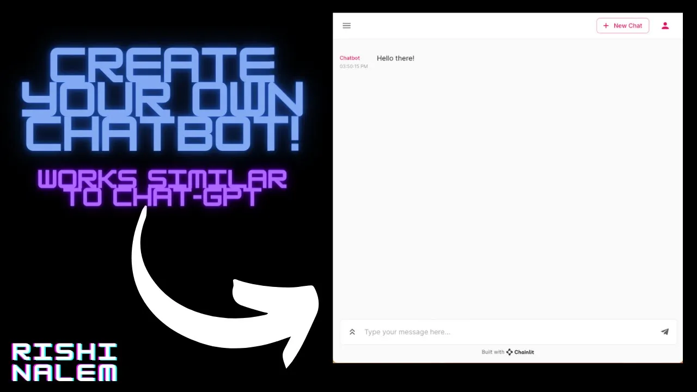

### Hi there 👋,
#### A Student Turning Concepts to a Reality with Programming and Robotics
My name is Rishi Nalem. I am an upcoming Freshman at Irvington High School. I have a deep passion for robotics and programming and I am preparing to pursue my dreams in the future. You can check out my Youtube at youtube.com/@programmingwithpranay.

## Skills and Experience
* 🐍 PYTHON
* 🤖 C++
* 🧑‍💻 JS
* 🌐 HTML
* 🌐 CSS
* 📱 FLUTTER
* 🤖 C
* 📱 SWIFT
* 📱 Kotlin
* Typescript
* Node.js

## Check Out my Projects!
* Chatbot Program: Create three different Chatbot programs nearing to 33 lines of code
* Create a language translation program that can translate between 5 different languages.
* Used Natural Language Processing in Alan AI Projects to create voice-controlled Pong game and a FAQ page
* Created radio encryption and decryption system
* Contributed to the development of Dillmans Emporium of Antiquities App during an internship
* Created a robot arm using Raspberry Pi and Arduino

          

 
  <h2 align="center">⚡ Current Stats ⚡</h2>
 

  
  

   

  
<!---->
